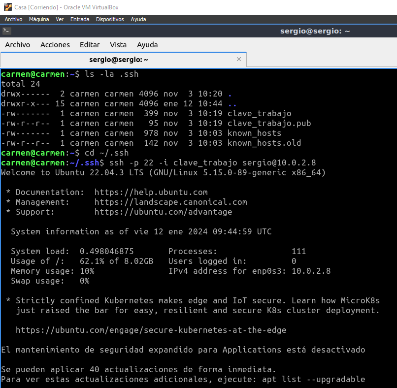
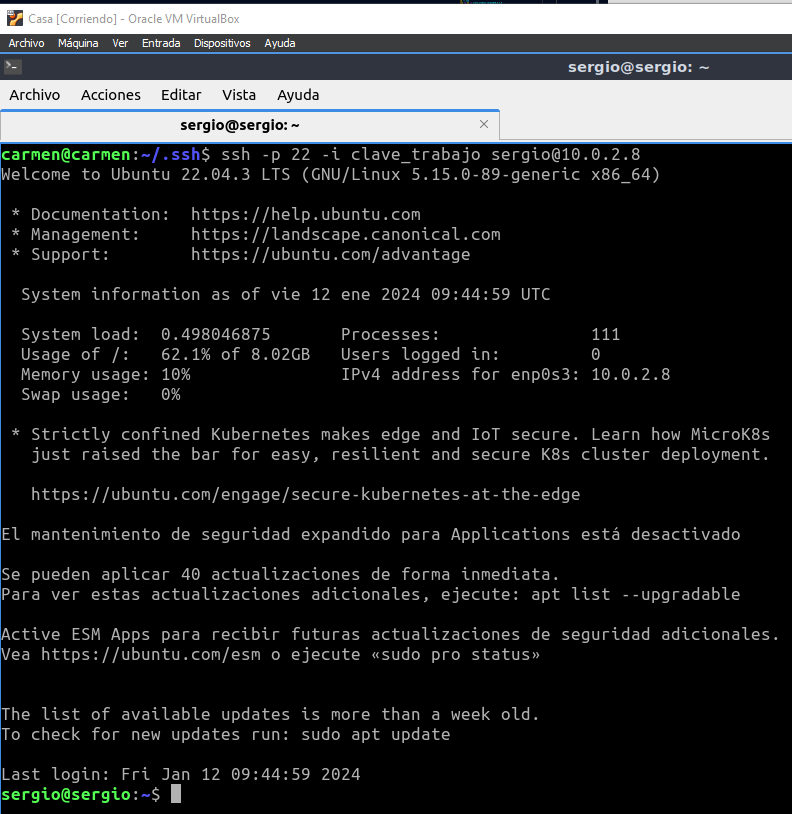

# Tarea 04 · Despliegue de Aplicaciones Web
___
## Oliver Fabian Stetcu Stepanov
___
### Tarea DNS · Servicio de nombres de dominios
___
## Bind 9
* https://www.isc.org/bind/
* https://bind9.readthedocs.io/
* https://www.fpgenred.es/DNS/index.html

# Infraestructura

Reutilizaremos las MV de la práctica de ``ssh``. Dos MV dentro de una ``red NAT``:
* **Servidor**: con un Ubuntu server sin entorno gráfico.
    * Usuario: ``sergio``, contraseña: ``sergio``.
* **Casa**: con un Lubuntu con el entorno gráfico por defecto (LXQt).
    * Usuario: ``carmen``, contraseña: ``carmen``.

Desde el equipo **Casa** nos conectaremos al equipo **Servidor** mediante una conexión ``ssh`` autentificándonos mediante claves asimétricas ``ed25519``.

## Instalación y uso básico

1. Acceder al servidor:

Desde el equipo de **Casa** ejecutamos el siguiente comando:

```bash
ls -la .ssh
cd ~/.ssh
ssh -p 22 -i clave_trabajo sergio@10.0.2.8
```

Utilizo la clave generada en la Tarea 01 (Tarea SSH - SCP - Shell - VirtualBox), también reutilizada para la Tarea 03, la clave se llama "**clave_trabajo**" (se puede omitir poner el puerto "-p 22"):

Resultado:





> Casi toda la instalación y configuración la debemos hacer con privilegios de administrador podemos ejecutar ``sudo`` en todas las instrucciones o cambiar al usuario administrador ``sudo su``.

2. Instalar bind 9:

```bash
sudo apt update
sudo apt install bind9 bind9utils
```

Resultado:


ssh -p 22 -i clave_trabajo sergio@10.0.2.8


cd /etc/bind/
ls
tree
cat named.conf
cat named.conf.options
cat named.conf.local


2.0.10.in-addr.arpa


