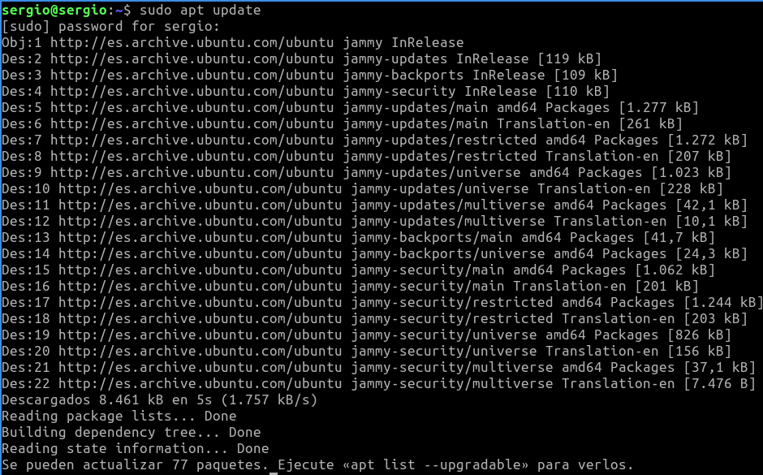
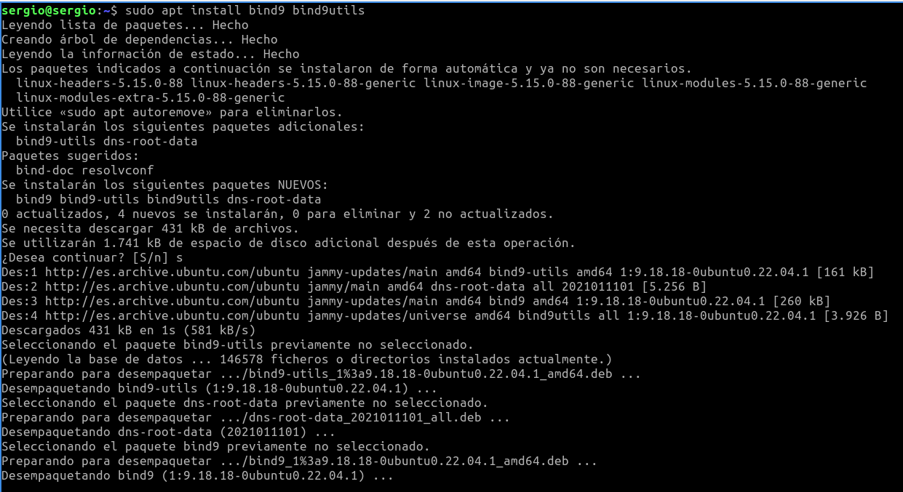
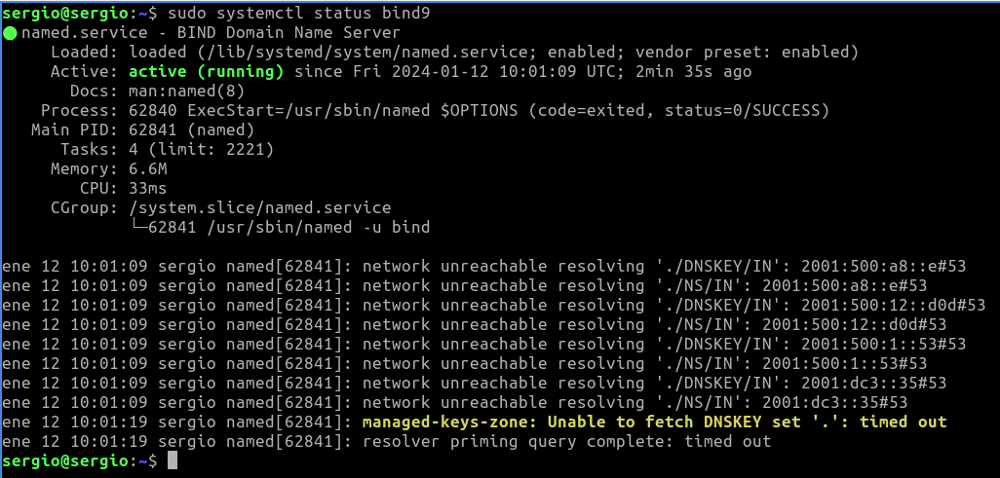
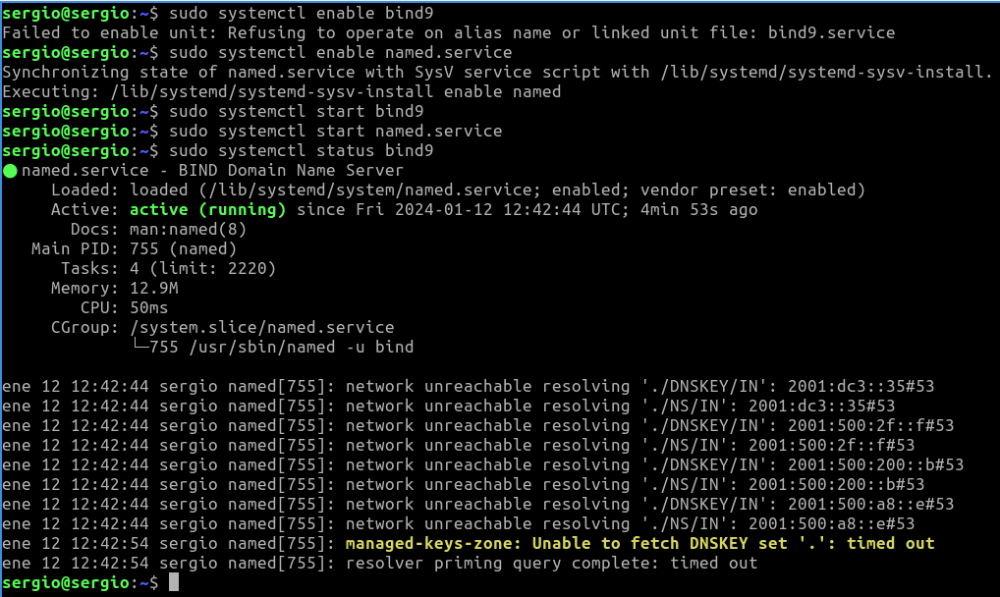
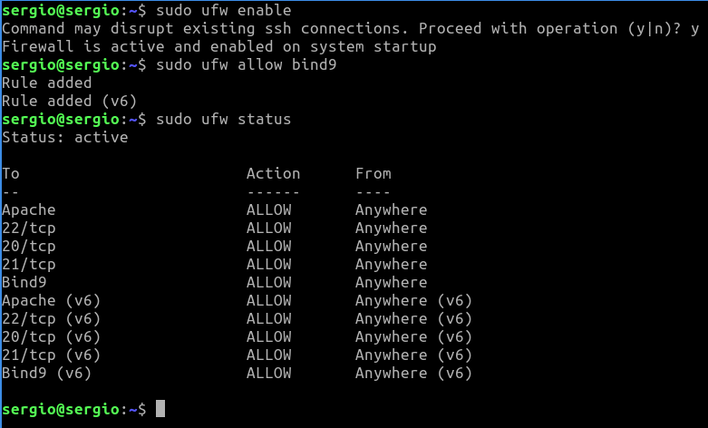
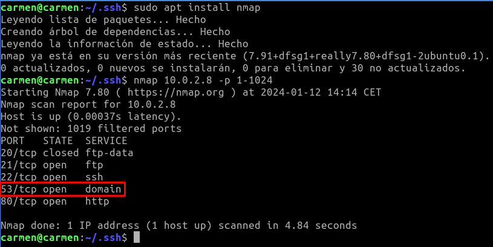
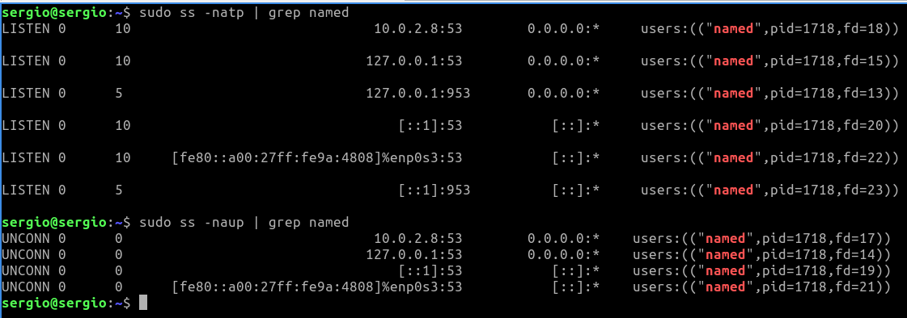
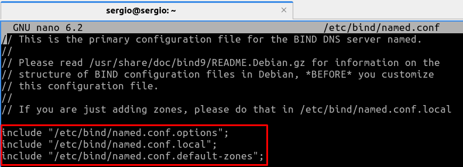

# Tarea 04 · Despliegue de Aplicaciones Web
___
## Oliver Fabian Stetcu Stepanov
___
### Tarea DNS · Servicio de nombres de dominios
___
## Bind 9
* https://www.isc.org/bind/
* https://bind9.readthedocs.io/
* https://www.fpgenred.es/DNS/index.html

# Infraestructura

Reutilizaremos las MV de la práctica de ``ssh``. Dos MV dentro de una ``red NAT``:
* **Servidor**: con un Ubuntu server sin entorno gráfico.
    * Usuario: ``sergio``, contraseña: ``sergio``.
* **Casa**: con un Lubuntu con el entorno gráfico por defecto (LXQt).
    * Usuario: ``carmen``, contraseña: ``carmen``.

Desde el equipo **Casa** nos conectaremos al equipo **Servidor** mediante una conexión ``ssh`` autentificándonos mediante claves asimétricas ``ed25519``.

## Instalación y uso básico

1. Acceder al servidor:

Desde el equipo de **Casa** ejecutamos el siguiente comando:

```bash
ls -la .ssh
cd ~/.ssh
ssh -p 22 -i clave_trabajo sergio@10.0.2.8
```

Utilizo la clave generada en la Tarea 01 (Tarea SSH - SCP - Shell - VirtualBox), también reutilizada para la Tarea 03, la clave se llama "**clave_trabajo**" (se puede omitir poner el puerto "-p 22"):

Resultado:


> Casi toda la instalación y configuración la debemos hacer con privilegios de administrador podemos ejecutar ``sudo`` en todas las instrucciones o cambiar al usuario administrador ``sudo su``.

2. Instalar bind 9:

```bash
sudo apt update
sudo apt install bind9 bind9utils
```

Resultado:



)

> La instalación crea el usuario ``bind`` que ejecuta el servicio dns denominado ``named``. Puedes comprobarlo mostrando el contenido del archivo ``/etc/passwd``.

3. Comprobar estado del servicio ``bind``:

```bash
sudo systemctl status bind9
```

Resultado:



> Muestra advertencias ya que aún no lo hemos configurado.

4. Con los siguientes comandos lo activaremos para que se inicie al arrancar el servidor y lo iniciaremos:

```bash
sudo systemctl enable bind9
sudo systemctl start bind9
sudo systemctl restart bind9
sudo systemctl status bind9
```

Resultado:




Con el comando ``sudo systemctl enable bind9`` me da error, pero si le cambio el ``bind9`` por ``named.service`` sí me deja, luego le hago el **start** al servicio y muestro el estado del servicio. Comprobamos que se está habilitado e iniciado. A la hora de hacer el **restart** ya no me aparece la línea de warning en amarillo.

5. Reglas firewall:

```bash
sudo ufw enable
sudo ufw allow bind9
sudo ufw status
```

Resultado:



6. Probar desde el cliente qué puertos tiene abiertos el servidor, en nuestro ejemplo desde el equipo **Casa** ejecutaremos:

```bash
exit
sudo apt install nmap
nmap 10.0.2.8 -p 1-1024
```

Resultado:



> Por defecto el servicio DNS utiliza el puerto 53.

> Si no tienes instalada esta utilidad, instalalá con: ``sudo apt install nmap``. Esta comprobación también se puede hacer desde el propio servidor, pero es menos fiable que desde otro equipo ya que puede conectarse por localhost.

7. Comprobar en el equipo Servidor qué conexiones tiene abiertas:

```bash
ssh -p 22 -i clave_trabajo sergio@10.0.2.8
sudo ss -natp | grep named
sudo ss -naup | grep named
```

Resultado:



## Archivos de configuración

1. El archivo principal de configuración del ``bind`` es: ``/etc/bind/named.conf``. En él vemos que hace referencia a otros tres archivos de configuración:

* ``/etc/bind/named.conf.options``: hace referencia al archivo de configuración que posee
opciones genéricas.
* ``/etc/bind/named.conf.local``: hace referencia al archivo de configuración para opciones
particulares.
* ``/etc/bind/named.conf.default-zones``: hace referencia al archivo de configuración de
zonas.

Abre el archivo y muesta estas referencias.

```bash
sudo nano /etc/bind/named.conf
```

Resultado:



## Verificar archivos de configuración

1. Puedes realizar una verificación de los ficheros de configuración y de zona por posibles fallos mediante los comandos ``named-checkconf`` y ``named-checkzone`` respectivamente. Estos comandos suelen ejecutarse con la siguiente sintaxis:


cd /etc/bind/
ls
tree
cat named.conf
cat named.conf.options
cat named.conf.local


2.0.10.in-addr.arpa


